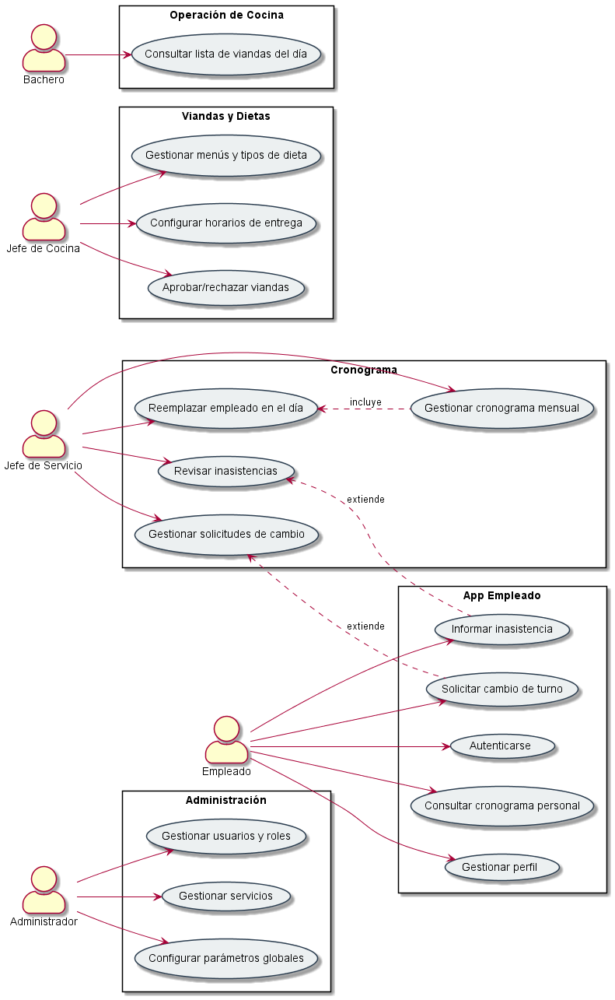
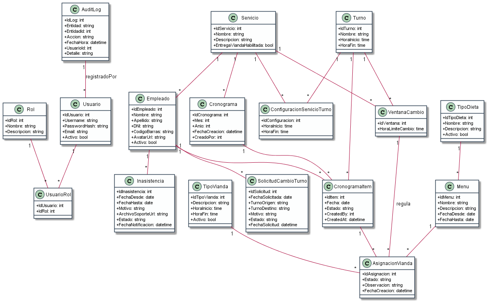

# Proyecto Cronograma y Viandas – Hospital

## Presentación

**Alumno:** [Jesús Emanuel GArcía]

**Fecha:** [15/11/2025]

---

## Tabla de contenido

1. [Introducción](#introducción)
2. [Justificación](#justificación)
3. [Objetivo general del proyecto](#objetivo-general-del-proyecto)
4. [Objetivos específicos del proyecto](#objetivos-específicos-del-proyecto)
5. [Objetivo general del sistema](#objetivo-general-del-sistema)
6. [Límite](#límite)
7. [Alcance](#alcance)
8. [No Contemplado](#no-contemplado)
9. [Tecnologías](#tecnologías)
10. [Competencia](#competencia)
11. [Listado de Requerimientos funcionales](#listado-de-requerimientos-funcionales)
12. [Listado de Requerimientos no funcionales](#listado-de-requerimientos-no-funcionales)
13. [Desarrollo del Prototipo](#desarrollo-del-prototipo)
    1. [Análisis y Diseño](#análisis-y-diseño)
    2. [Diagrama de Casos de Uso más relevantes](#diagrama-de-casos-de-uso-más-relevantes)
    3. [Diagrama de Clases](#diagrama-de-clases)
    4. [Interfaz Gráfica](#interfaz-gráfica)
14. [Bibliografía](#bibliografía)
15. [Anexo I](#anexo-i)

---

## Introducción

El proyecto **Cronograma y Viandas – Hospital** se desarrollará en un entorno hospitalario donde actualmente la planificación de turnos y la entrega de viandas al personal se realiza de forma manual y dispersa.

El objetivo general es **digitalizar y automatizar** el proceso de:

- Gestión de cronogramas mensuales por servicio y empleado.
- Asignación de viandas según turnos y reglas de horario.
- Control de dietas, inasistencias, solicitudes de cambio de turno y aprobación de viandas.

### ANTECEDENTES

Actualmente, la planificación de turnos y la asignación de viandas se realiza mediante planillas en papel o archivos dispersos. Esto genera:

- Falta de trazabilidad en quién recibió viandas y cuándo.
- Dificultad para controlar costos y consumo real vs. planificado.
- Errores en la asignación de viandas (entregas a personal no habilitado o fuera de horario).
- Procesos manuales para registrar inasistencias y cambios de turno.

Se han utilizado planillas de cálculo y registros manuales como soluciones parciales, pero no existe un sistema integrado que contemple cronograma, viandas, dietas, inasistencias y reportes en un único sistema.

### DESCRIPCIÓN DEL ÁREA PROBLEMÁTICA

El área problemática abarca principalmente:

- **Servicios hospitalarios** (enfermería, guardia, laboratorio, etc.) donde se gestionan turnos y cronogramas.
- **Cocina / comedor** donde se preparan y entregan las viandas según turnos y tipos de dieta.
- **Personal empleado** que cumple turnos rotativos y tiene derecho a viandas según su jornada.

Factores involucrados:

- Multiplicidad de servicios y turnos.
- Reglas de horario de entrega que deben cumplirse estrictamente.
- Requerimientos de dietas especiales.
- Rotación y ausencias del personal.

Magnitud y frecuencia del problema:

- Procesos diarios, con varias entregas de viandas por día (desayuno, almuerzo, merienda, cena).
- Errores frecuentes en el registro y control de entregas.

Personas e instituciones involucradas:

- Jefes de Servicio.
- Jefe de Cocina y personal de cocina.
- Empleados hospitalarios.
- Área de sistemas (para soporte e infraestructura).

### FORMULACIÓN DE LA PROBLEMÁTICA

¿**Cómo digitalizar y automatizar la gestión de cronogramas laborales y la asignación de viandas al personal hospitalario, garantizando control de horarios, dietas, ausencias y aprobaciones, reduciendo errores y mejorando la trazabilidad del proceso**?

---

## Justificación

El proyecto es relevante porque aborda un proceso crítico diario del hospital: la correcta alimentación del personal en función de sus horarios y dietas.

**Necesidades que se satisfacen:**

- Disminuir errores en la entrega de viandas.
- Asegurar que solo reciban vianda quienes corresponden y en el horario correcto.
- Tener trazabilidad de cronogramas, inasistencias, cambios de turno y entregas.
- Obtener reportes para control de costos y planificación.

**Impacto tecnológico:**

- Introduce una solución basada en **ASP.NET Core Web API**, **aplicación móvil Android** y una **base de datos relacional** con buenas prácticas (migraciones, autenticación JWT, etc.).

**Relevancia para la institución:**

- Mejora la eficiencia operativa de servicios y cocina.
- Facilita auditorías internas y externas.
- Reduce el trabajo manual y los errores asociados.

En resumen, el proyecto aporta **interés**, **utilidad** y **factibilidad**, alineado con los objetivos de la materia al integrar análisis, diseño y desarrollo de un sistema de información completo.

---

## Objetivo general del proyecto

Diseñar y desarrollar un **prototipo de sistema de información** que integre la gestión de cronogramas laborales, asignación de viandas, control de dietas, inasistencias y solicitudes de cambio de turno para el personal hospitalario, brindando herramientas de administración, consulta y reporte a los distintos actores involucrados.


## Objetivos específicos del proyecto

- Analizar la situación actual de gestión de cronogramas y viandas en el hospital.
- Modelar el dominio del problema utilizando UML (casos de uso, clases, etc.).
- Definir y documentar los requerimientos funcionales y no funcionales del sistema.
- Implementar un backend en **ASP.NET Core Web API + MVC** para exponer servicios REST.
- Implementar una aplicación móvil Android para empleados y Jefes de Servicio.
- Implementar un panel web para administración, Jefe de Servicio y Jefe de Cocina.
- Incorporar autenticación y autorización basada en roles.
- Implementar la lógica de: cronograma, generación de viandas, aprobación y ventanas de cambio.
- Desarrollar reportes básicos y registro de auditoría.
- Realizar pruebas (unitarias y de integración) sobre las funcionalidades críticas.

---

## Objetivo general del sistema

**Gestionar** de forma centralizada el cronograma laboral del personal hospitalario y la **asignación de viandas** asociadas, controlando horarios, dietas, inasistencias y aprobaciones, mediante una aplicación web y móvil integrada.

---

## Límite

El sistema abarca el proceso de negocio **desde la planificación de turnos y cronogramas del personal**, pasando por la **generación y aprobación de viandas**, hasta la **disponibilización de listados operativos de entrega y reportes de consumo**.

Quedan fuera de este límite:

- Procesos clínicos o médicos del hospital.
- Gestión de stock de alimentos (más allá de la información de menús y viandas planificadas).

---

## Alcance

Dentro del límite definido, el sistema contempla, en términos generales, los siguientes procesos de negocio:

- Gestión de servicios y empleados.
- Definición de turnos y cronogramas mensuales por servicio.
- Configuración de tipos de vianda y dietas.
- Configuración de horarios de entrega y ventanas límite de cambio.
- Generación automática de viandas según cronograma y reglas configuradas.
- Aprobación/rechazo de viandas por parte del Jefe de Cocina.
- Gestión de solicitudes de cambio de turno por empleados.
- Gestión de inasistencias con adjunto de certificado.
- Consulta del cronograma personal por parte del empleado.
- Emisión de reportes básicos y auditoría de cambios.

---

## No Contemplado

Procesos que se encuentran dentro del límite general del sistema, pero que **no** se implementan en esta primera entrega (ver detalle completo en [ProyectoCronogramaViandas_MVP1.md](./ProyectoCronogramaViandas_MVP1.md)):

- Confirmación de entrega de viandas por parte del Bachero vía aplicación móvil.
- Módulo móvil completo para Jefe de Cocina (en MVP1 se limita a interfaz web).
- Gestión avanzada de entregas excepcionales a personal de visita (alta de personas "ad hoc").
- Reportes avanzados y tableros de BI (más allá de los reportes básicos definidos).

**Segunda Entrega:**

En la segunda entrega se implementará:

- Interfaz Web completa (Web Service) para todos los roles del sistema.
- Integración con SignalR para notificaciones en tiempo real y actualización dinámica de datos.

---

## Tecnologías

**Backend:**

- ASP.NET Core Web API / MVC.
- Entity Framework Core (migraciones, LINQ).
- Identity + JWT para autenticación.

**Frontend Web:**

- ASP.NET Core MVC (Razor) y/o React/Blazor para panel administrativo.
- HTML5, CSS3, Bootstrap / Tailwind (según elección de implementación).

**App Móvil:**

- Android (patrón MVVM).
- Retrofit para consumo de APIs REST.
- SignalR para notificaciones en tiempo real y comunicación bidireccional.

**Base de datos:**

- SQL Server o PostgreSQL.

**Infraestructura:**

- Contenedores Docker para despliegue.
- Herramientas de CI/CD (a definir: GitHub Actions, Azure DevOps, etc.).

Las tecnologías seleccionadas son coherentes con la arquitectura propuesta en la documentación del proyecto.

---

## Competencia

En el mercado existen sistemas de gestión hospitalaria y de recursos humanos que incluyen módulos de turnos y, en algunos casos, de alimentación, por ejemplo:

- Sistemas de gestión hospitalaria integrales (HIS) con módulos de turnos.
- Sistemas de RRHH con gestión de turnos y asistencia.

Sin embargo, la propuesta se diferencia por:

- Foco específico en **cronograma + viandas + dietas** para personal hospitalario.
- Integración directa con app móvil para empleados y Jefes de Servicio.
- Parametrización detallada de **ventanas de entrega** y **ventanas de cambio** por servicio, tipo de vianda y turno.


## Listado de Requerimientos funcionales

Basado en el documento **MVP1**:

1. CRUD de Empleados, Usuarios, Roles, Servicios, Turnos, Tipos de Vianda, Tipos de Dieta, Menús/Viandas.
2. Configuración por servicio de horarios de entrada y salida para cada turno.
3. Generador automático de viandas basado en cronograma y reglas de horario.
4. Flujo de aprobación de viandas por Jefe de Cocina (aprobar/rechazar con observaciones).
5. Habilitación/deshabilitación de tipos de vianda según horario y servicio.
6. Gestión de horarios de entrega parametrizables por tipo de vianda y por servicio.
7. Definición de ventanas límite para cambios/reemplazos el mismo día (`VentanaCambio`).
8. Gestión de cronogramas mensuales por servicio (crear/editar).
9. Cambio/reemplazo de empleado asignado en el cronograma, respetando la ventana límite.
10. Acceso de Empleados vía app (login con DNI y contraseña) para ver cronograma personal.
11. Solicitud de cambio de turno por empleado, con motivo y empleado sugerido opcional.
12. Gestión de estado de solicitud de cambio (pendiente/aprobada/rechazada).
13. Informe de inasistencia por empleado con adjunto de certificado.
14. Perfil de empleado en la app (ver datos, cambiar avatar, cambiar contraseña).
15. Notificaciones push para cronogramas, solicitudes, inasistencias y viandas.
16. Reportes exportables (PDF/Excel) por día, servicio, tipo de dieta, asignaciones y ausencias.
17. Auditoría de cambios (quién hizo qué y cuándo) en cronogramas, aprobaciones y solicitudes.

---

## Listado de Requerimientos no funcionales

- **Usabilidad:**
  - Interfaces adaptadas al uso en entorno hospitalario, con navegación simple y clara.
- **Confiabilidad:**
  - Manejo de errores y validaciones en operaciones críticas (generación de viandas, cambios, inasistencias).
- **Performance:**
  - Consultas de calendario optimizadas, paginación en listados.
- **Portabilidad:**
  - Backend desplegable en contenedores Docker.
  - App Android compatible con versiones actuales del sistema operativo (según decisión).
- **Seguridad:**
  - Autenticación con Identity + JWT.
  - Control de acceso basado en roles y claims.
- **Auditoría y trazabilidad:**
  - Registro de eventos en `AuditLog`.
- **Interoperabilidad:**
  - API REST para integración futura con otros sistemas del hospital.

---

## Desarrollo del Prototipo

### Análisis y Diseño

El desarrollo del prototipo se basa en un análisis exhaustivo documentado en los siguientes archivos técnicos:

- **[ProyectoCronogramaViandas_MVP1.md](./ProyectoCronogramaViandas_MVP1.md)**: Define el alcance completo de la primera entrega, incluyendo requerimientos funcionales y no funcionales, arquitectura propuesta, modelo de datos, reglas de negocio y endpoints de la API REST.

- **[ProyectoCronogramaViandas_Gantt_QA.md](./ProyectoCronogramaViandas_Gantt_QA.md)**: Contiene el cronograma detallado del proyecto (diagrama de Gantt) y el plan de pruebas (QA) para asegurar la calidad del sistema.

**Decisiones de diseño principales:**

1. **Arquitectura en capas:**
   - **Capa de presentación**: App Android (MVVM) + Panel Web (MVC/React/Blazor)
   - **Capa de API**: ASP.NET Core Web API con endpoints REST
   - **Capa de lógica de negocio**: Servicios que implementan reglas de cronograma, viandas y ventanas de cambio
   - **Capa de acceso a datos**: Entity Framework Core con patrón Repository

2. **Modelo de dominio:**
   - **Entidades principales**: Usuario, Rol, Empleado, Servicio, Turno, Cronograma, CronogramaItem, TipoVianda, TipoDieta, Menu, AsignacionVianda, VentanaCambio, SolicitudCambioTurno, Inasistencia, AuditLog
   - **Relaciones clave**: Un Servicio tiene múltiples Empleados; un Cronograma tiene múltiples CronogramaItems; cada AsignacionVianda se genera desde un CronogramaItem considerando las VentanaCambio configuradas

3. **Flujos críticos:**
   - **Generación de viandas**: A partir del cronograma mensual, el sistema genera automáticamente AsignacionVianda en estado PENDIENTE respetando horarios configurados por TipoVianda y Servicio
   - **Aprobación de viandas**: El Jefe de Cocina revisa y aprueba/rechaza las viandas generadas
   - **Gestión de cambios de turno**: Los empleados solicitan cambios vía app; el Jefe de Servicio aprueba/rechaza respetando las VentanaCambio configuradas
   - **Registro de inasistencias**: Los empleados informan inasistencias con adjunto de certificado; el sistema notifica al Jefe de Servicio

4. **Seguridad y autenticación:**
   - ASP.NET Core Identity para gestión de usuarios
   - JWT (JSON Web Tokens) para autenticación en la API
   - Control de acceso basado en roles (Administrador, Jefe de Servicio, Jefe de Cocina, Bachero, Empleado)
   - Empleados autentican con DNI + contraseña

5. **Parametrización y configurabilidad:**
   - Horarios de entrega por TipoVianda (desayuno, almuerzo, merienda, cena) configurables por Servicio
   - Ventanas límite de cambio (`VentanaCambio`) parametrizables para controlar hasta qué hora se pueden hacer modificaciones el mismo día
   - Tipos de dieta personalizables (normal, blanda, diabético, etc.)

---

### Diagrama de Casos de Uso más relevantes

A continuación se incluirán las imágenes de los casos de uso más importantes.

- **Diagrama de casos de uso general** (Administración, Jefe de Servicio, Jefe de Cocina, Empleado, Bachero).

```markdown

```

---

### Diagrama de Clases

Se incluirá un diagrama de clases que refleje las entidades principales:

- Usuario, Rol, Empleado, Servicio, Turno, Cronograma, CronogramaItem, TipoVianda, TipoDieta, Menu, AsignacionVianda, VentanaCambio, SolicitudCambioTurno, Inasistencia, AuditLog.

```markdown

```

---

### Interfaz Gráfica

En esta sección se documentarán los prototipos de las vistas más importantes.

- **Web – Panel Administrativo:**

```markdown

```

- **App Android – Jefe de Servicio (Dashboard + Cronograma):**

```markdown

```

- **App Android – Empleado (Cronograma + Solicitud de cambio + Inasistencia):**

```markdown

```

_(Los mockups pueden ser bocetos realizados en herramientas como Figma, Draw.io, Balsamiq, etc.)_

---

## Bibliografía

- Material de la cátedra sobre análisis y diseño de sistemas.
- Documentación oficial de ASP.NET Core y Entity Framework Core.
- Documentación de Android (Kotlin, Retrofit, Room, FCM).

---

## Anexo I

En el Anexo se pueden incluir:

- Gantt detallado del proyecto.
- Detalle ampliado de casos de uso.
- Capturas adicionales de interfaz o prototipos.
